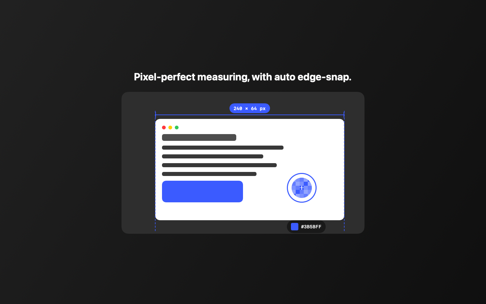
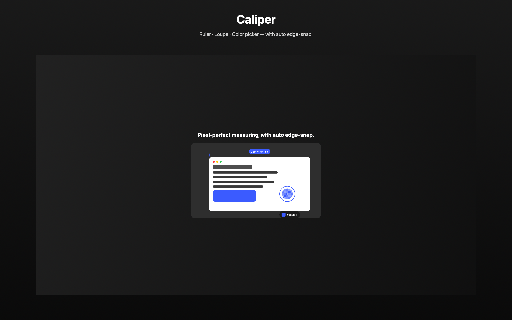

<div align="center">

# Caliper

### On-screen pixel ruler, loupe & color picker — with auto edge-snap.

Draw a precise measurement guide over any UI, magnify pixels with a loupe, and read back colors as hex/HSL. Caliper's differentiator is **automatic edge-snap**: a real on-device edge detector finds element boundaries so your measurement endpoints lock to the actual edges, not "close enough." 100% local. Free & open source.

A free, native macOS replacement for paid pixel rulers and color pickers.



</div>

> The images below are generated by Caliper itself (`swift run CaliperChecks docs/images`). To use your own, drop PNGs into `docs/images/` and update the links.

---

## What it does

| | |
|---|---|
|  |  |
| **Measurement guide** with end-caps + live `W × H px` badge, snapped to element edges | **Loupe + color readout** — zoomed pixel grid, crosshair, hex/HSL chip |

### Auto edge-snap (on-device)

Caliper runs a Sobel gradient edge detector over the captured pixels, accumulates gradient energy per column and per row, and locks your measurement endpoints to the detected element boundaries — entirely on-device, no network. Toggle it off for free-hand measuring.

---

## Capabilities

| Area | Features |
|---|---|
| **Measure** | Transparent overlay **ruler** · pixel-perfect width × height with end-caps + live badge · adjustable endpoints |
| **Edge-snap** | On-device **Sobel edge detection** finds element boundaries · endpoints snap to the nearest edge within tolerance · visible snap guides |
| **Loupe** | Magnifier with zoomed **pixel grid** + crosshair for sub-pixel placement |
| **Color** | **Color picker** with multiple formats — `#RRGGBB` hex and HSL readout · swatch chip |
| **Capture** | Live screen capture via **ScreenCaptureKit** (user-granted Screen Recording) · works on any window or region |
| **Trust** | 100% local — pixels never leave your Mac · no telemetry in the shipped build |

---

## Architecture

Caliper is an **open-source shell** + a **proprietary engine** (`EdgeEngine`). In public releases the engine ships as a precompiled binary; in this repository it builds from source.

```
Sources/Caliper      executable (@main)   — app entry, menus, settings, logging bootstrap
Sources/CaliperUI    library (OSS)        — overlay/measuring UI + view model
Engines/EdgeEngine   library (proprietary)— edge detection, snapping, color conversion
Packages/Core        shared modules       — DesignSystem, RemoteConfigKit, LicenseKit, UpdateKit, LogKit, ScreenshotKit
```

### EdgeEngine — public API

```swift
struct SnapLines: Sendable { let verticalX: [Int]; let horizontalY: [Int] }

struct EdgeEngine: Sendable {
    func detectSnapLines(in cg: CGImage, threshold: Double = 0.25) -> SnapLines
    func nearestSnap(to value: Int, in candidates: [Int], maxDistance: Int = 12) -> Int?
    func hexString(r: Int, g: Int, b: Int) -> String
    func rgbToHSL(r: Double, g: Double, b: Double) -> (h: Double, s: Double, l: Double)
    static func makeSyntheticImage(...) -> CGImage?
}
```

- **Feature flags** (paid features, in-app updates, force-update) are built but **gated OFF** via Firebase Remote Config (`RemoteConfigKit`) and flipped on later with no app update. `GoogleService-Info.plist` is **not** committed.
- **Logging**: every run writes to `~/Library/Containers/com.plainware.caliper/Data/Library/Logs/Plainware/Caliper.log` (sandboxed) — `tail -f` it to debug.

## Build & run (no Xcode required)

```bash
Scripts/bundle.sh --package-dir . --product Caliper --name Caliper \
  --bundle-id com.plainware.caliper --info-plist Resources/Info.plist \
  --entitlements Resources/Caliper.entitlements --icon Resources/AppIcon.icns --open
```

Run the test suite + regenerate the gallery / App Store screenshots (off-screen, no permissions):

```bash
swift run CaliperChecks ./screenshots
```

For the **Mac App Store** build/submission, see [`docs/APP_STORE_SUBMISSION.md`](docs/APP_STORE_SUBMISSION.md).

## License

App shell: **MIT** (see [`LICENSE`](LICENSE)). The `EdgeEngine` module is proprietary and distributed in binary form in public releases.
